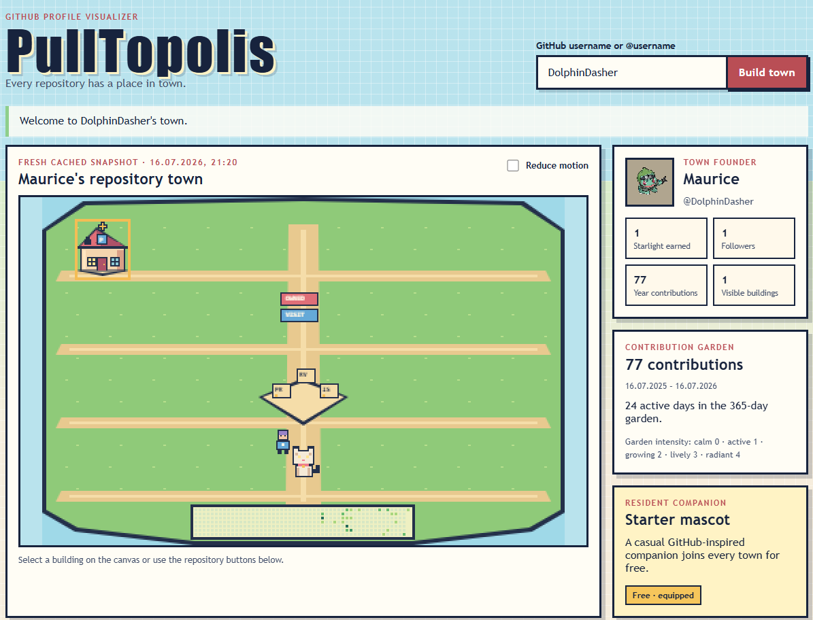
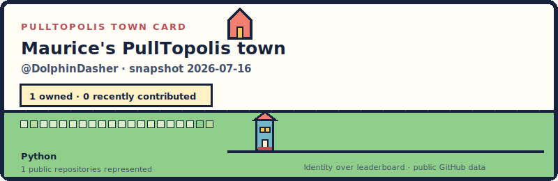

<h1 align="center">🏙️ PullTopolis</h1>

<p align="center"><strong>Your GitHub profile, but it is a tiny pixel town.</strong></p>

<p align="center">
  Turn public repositories, languages, stars, contributions, and collaborations into a town you can explore—and download your own town card for your GitHub profile README.
</p>

<p align="center">
  <a href="#build-your-town">Build your town</a> ·
  <a href="#put-your-town-in-your-github-readme">Add it to your profile</a> ·
  <a href="#how-it-works">See how it works</a>
</p>

---

I built PullTopolis because GitHub profiles are full of interesting work, but they can still feel a bit like spreadsheets. I wanted mine to feel like a place instead.

In PullTopolis, every repository gets a building. Languages influence its look, stars make it more prominent, contributions grow a garden, and followers wander around as visitors. Repositories that have been quiet for a while are not ruined or abandoned—they are just resting. There is no “good developer” score hiding behind the town.

The result is an anime-inspired pixel-art city made from public GitHub data, plus a small self-contained SVG card you can keep in your profile README, a project page, a portfolio, or anywhere else that accepts images.

## See it in action

[](#build-your-town)

<p align="center"><em>My real <code>@DolphinDasher</code> profile turned into a repository town. Click the screenshot to build yours.</em></p>

And this is the town card the website generated from the same snapshot:

[](#put-your-town-in-your-github-readme)

<p align="center"><strong>No design work needed:</strong> enter a username, let the town build, download the SVG, and paste the provided Markdown.</p>

> [!IMPORTANT]
> PullTopolis is working locally, including the town-card download flow, but there is no public hosted website yet. Hosting is a planned checkpoint. Until then, the steps below launch the full website on your computer.


## What is in your town?

| GitHub data | What it becomes |
| --- | --- |
| Your public, owned repositories | Buildings in the owned district |
| Repositories GitHub says you recently contributed to | A separate collaboration district |
| Repository stars | Building prominence |
| Stars on owned public, non-fork repositories | Earned **Starlight** |
| Primary and secondary languages | Architecture, colors, and language details |
| Repository push recency | Active, warm, quiet, or resting ambience |
| Archived repositories | Peaceful heritage buildings—not damaged ones |
| Your last 365 contribution days | A day-by-day garden |
| Followers | Visitors in the streets |
| Recent pull requests, issues, and reviews | Activity around the civic square |

The same validated snapshot always creates the same layout. PullTopolis displays up to 12 repository buildings and reports any additional repositories as overflow, so large profiles still stay readable.

The collaboration district uses GitHub's **recently contributed-to** data. It is deliberately kept separate from owned repositories and is not presented as a complete lifetime history.

## Build your town

### You will need

- [Node.js](https://nodejs.org/) 22.12 or newer
- Git
- A GitHub personal access token for reading public profile data

The token does not need private-repository or write access. Please do not give it permissions PullTopolis does not use.

### 1. Clone and install

```powershell
git clone https://github.com/DolphinDasher/pulltopolis.git
Set-Location pulltopolis
npm.cmd ci
Copy-Item .env.example .env
```

On macOS or Linux, use `npm` instead of `npm.cmd` and `cp .env.example .env` instead of `Copy-Item`.

### 2. Add your token

Open `.env` and fill in the server-only token:

```dotenv
GITHUB_TOKEN=your_token_here
```

Never rename this to a `VITE_` variable. Vite variables can be bundled into browser code; the GitHub token belongs only on the Express server.

### 3. Start the website

```powershell
npm.cmd run dev
```

Open [http://127.0.0.1:5173](http://127.0.0.1:5173), enter a public GitHub username (with or without `@`), and click **Build town**.

You can select buildings directly on the canvas or use the keyboard-friendly repository directory below it. The page also includes exact repository details, snapshot freshness, a reduced-motion toggle, and accessible text summaries.

## Put your town in your GitHub README

Once your town has loaded:

1. Find the **README town card** section.
2. Preview the generated card and click **Download SVG**.
3. Click **Copy Markdown**.
4. Put the downloaded SVG beside the `README.md` in your GitHub profile repository.
5. Paste the copied Markdown into that README and push both files.

The generated line looks like this:

```md

```

Your profile repository is the public repository whose name exactly matches your GitHub username. GitHub renders its `README.md` on your profile page. The same SVG also works in normal repository documentation, portfolio sites, and other places that support SVG images.

Each card is:

- generated entirely in your browser from the loaded `TownSnapshot`;
- deterministic, so the same snapshot produces the same card;
- a compact 800×260 SVG that scales cleanly;
- accessible, with an SVG title and description;
- self-contained, with no remote fonts, avatars, images, scripts, stylesheets, or tracking URLs;
- honest about owned repositories versus recently contributed-to repositories.

The SVG is a saved snapshot, not a live hosted badge. When you want the card to show newer GitHub data, build the town again and replace the old file.

## Features

- Anime-inspired pixel art drawn with native Canvas 2D
- Crisp 16×16 logical tiles and integer scaling
- Deterministic buildings and layout from stable GitHub IDs and versioned rules
- Separate owned and recently contributed-to districts
- Exact 365-day contribution garden
- Inspectable counts alongside friendly visual tiers
- A free GitHub-inspired starter cat in every town
- Display-only Starlight earned from stars
- Downloadable, repository-ready SVG town card
- Pointer and keyboard repository selection kept in sync
- Responsive layout and `prefers-reduced-motion` support
- Safe loading, not-found, GitHub outage, and rate-limit states
- Local SQLite fresh/stale caching and single-flight GitHub refreshes
- One production process serving both the UI and API

Starlight cannot be spent yet. The animal shop, purchases, saved companions, and desktop pet are future ideas, so the starter cat is currently free for everyone.

## How it works

```text
Public GitHub username
         │
         ▼
GitHub GraphQL API
         │  server-held token
         ▼
Express data adapter
         │
         ├──► deterministic mapper ───► TownSnapshot v1
         │                                  │
         │                                  ├──► SQLite-compatible snapshot cache
         │                                  ├──► Canvas 2D town
         │                                  └──► self-contained SVG card
         ▼
  safe typed errors
```

`TownSnapshot` is the only JSON contract shared between the GitHub-aware server and the browser renderer. The browser never receives the GitHub token or a raw GitHub API response. Structural contract changes increment `schemaVersion`; changes to the town-mapping rules increment `mappingVersion`.

The mapper uses the snapshot timestamp and stable IDs instead of the current wall clock or unseeded randomness. That makes stored towns reproducible and lets visual code change without teaching the GitHub adapter anything about Canvas.

### Stack

| Layer | Technology |
| --- | --- |
| Language | Strict TypeScript in Node.js and the browser |
| Frontend | Semantic HTML, CSS, plain TypeScript, Vite |
| Town renderer | Native Canvas 2D |
| Server | Express 5 and native `fetch` |
| GitHub data | GraphQL-first adapter with serial pagination and rate-limit protection |
| Cache | Local SQLite through `better-sqlite3` |
| Tests | Node's built-in test runner through `tsx` |
| Production | Compiled Express server serving the Vite build and `/api` from one process |

There is intentionally no React, game engine, ORM, GraphQL server, user account system, or paid service in the MVP. This is a small project, and I would like the code to stay understandable before it becomes clever.

### Cache behavior

- A snapshot is fresh for 30 minutes.
- A stale snapshot can be returned immediately while one refresh runs in the background.
- A snapshot hard-expires after 24 hours.
- Concurrent refreshes for the same normalized username share one request.
- The database stores mapped snapshots and cache metadata—not raw GitHub payloads or credentials.

### API

| Endpoint | Purpose |
| --- | --- |
| `GET /api/health` | Reports server, GitHub-token, and database readiness without revealing secrets |
| `GET /api/towns/:login` | Returns the validated `TownSnapshot` JSON for a public user |

Town responses include `X-PullTopolis-Cache: fresh`, `stale`, or `refreshed`. API failures use small typed JSON errors instead of copying GitHub's upstream error text into responses.

### Project structure

```text
pulltopolis/
├── index.html                 # semantic application shell
├── src/
│   ├── client/                # UI, API boundary, SVG card, and Canvas renderer
│   ├── server/                # Express, GitHub adapter, mapper, cache, and runtime
│   └── shared/                # TownSnapshot contract and validation
├── scripts/dev.mjs            # local Vite + Express launcher
├── package.json
├── tsconfig.json
└── vite.config.ts
```

Tests live beside the modules they cover as `*.test.ts` files.

## Configuration

All runtime settings are server-side:

| Variable | Default | Purpose |
| --- | --- | --- |
| `GITHUB_TOKEN` | none | Enables GitHub-backed town requests |
| `HOST` | `127.0.0.1` | Express bind address |
| `PORT` | `3000` | Express/API port |
| `DATABASE_PATH` | `data/pulltopolis.sqlite` | Local SQLite cache path |
| `GITHUB_REQUEST_TIMEOUT_MS` | `10000` | GitHub request timeout |
| `GITHUB_RATE_LIMIT_RESERVE` | `100` | Remaining GraphQL points protected from use |

The server can boot without `GITHUB_TOKEN`, which keeps the health route available, but town requests will stay disabled until the token is configured.

## Commands

| Command | What it does |
| --- | --- |
| `npm.cmd run dev` | Starts Vite on port 5173 and Express on port 3000 |
| `npm.cmd run dev:client` | Starts only the Vite client |
| `npm.cmd run dev:server` | Starts only the watched Express server |
| `npm.cmd run typecheck` | Runs strict TypeScript checks without emitting files |
| `npm.cmd test` | Runs the complete test suite |
| `npm.cmd run build` | Builds the server and client into `dist/` |
| `npm.cmd start` | Serves the production build on port 3000 |

For a production-style local run:

```powershell
npm.cmd run build
npm.cmd start
```

Then open [http://127.0.0.1:3000](http://127.0.0.1:3000).

## Verify a change

Please run the full checkpoint before considering a change finished:

```powershell
npm.cmd run typecheck
npm.cmd test
npm.cmd run build
```

Visual changes should also be checked in a real browser at desktop and mobile widths, with keyboard controls, reduced motion, loading/error states, and crisp Canvas scaling.

## Privacy and security

PullTopolis reads public GitHub profile and repository information with an operator-provided, server-held token.

- No private repositories or organization towns
- No end-user login, OAuth flow, or GitHub App installation
- No write operations against GitHub
- No token in browser code, local storage, URLs, snapshots, fixtures, or API errors
- No raw GitHub payloads stored in SQLite
- No analytics or tracking in the MVP
- No remote content embedded in downloaded town cards

If a token is ever committed or shared, revoke it immediately and create a replacement. `.env`, `data/`, `dist/`, and `node_modules/` are intentionally ignored by Git.

## Current limits

- Public GitHub user profiles only; organizations and private activity are unsupported.
- GitHub's recently contributed-to connection is not an exhaustive lifetime history.
- GitHub contribution-calendar values are not a complete audit of every commit a person authored.
- Only 12 repositories are drawn as buildings; exact overflow counts remain visible.
- Contributed-building recency describes the repository, not necessarily the viewed user's latest action.
- Starlight is earned/display-only and companion ownership is not persisted.
- The local SQLite cache assumes one process and a persistent filesystem.
- There is no hosted demo or live image endpoint yet.

## Roadmap

- Evaluate a free hosted version after request throttling, durable storage, deployment configuration, and public verification
- Add a Starlight-funded animal shop with deliberately designed pricing and persistence
- Let people equip and save companions
- Explore a desktop companion connected to GitHub activity
- Add more town events and visual variety without breaking deterministic snapshots
- Investigate an optional live card only if it can preserve the current privacy and cost boundaries

## Contributing

This started as a fun student project, and contributions, bug reports, and small ideas are welcome. If you want to change product rules (especially game math, the economy, authentication, persistence or GitHub permissions) please open a discussion first so the town stays coherent and does not quietly ask for more user data.

For code changes:

1. Fork the repository and create a focused branch.
2. Keep the existing plain-TypeScript, Canvas 2D, Express, and `TownSnapshot` boundaries unless there is a demonstrated blocker.
3. Add or update focused tests.
4. Run type-checking, tests, and the production build.
5. Explain what changed and why in your pull request.

## License

PullTopolis is available under the [MIT License](./LICENSE).

---

<p align="center">
  <strong>Every repository has a place in town.</strong><br />
  If you build yours, I would genuinely love to see where you put it.
</p>
